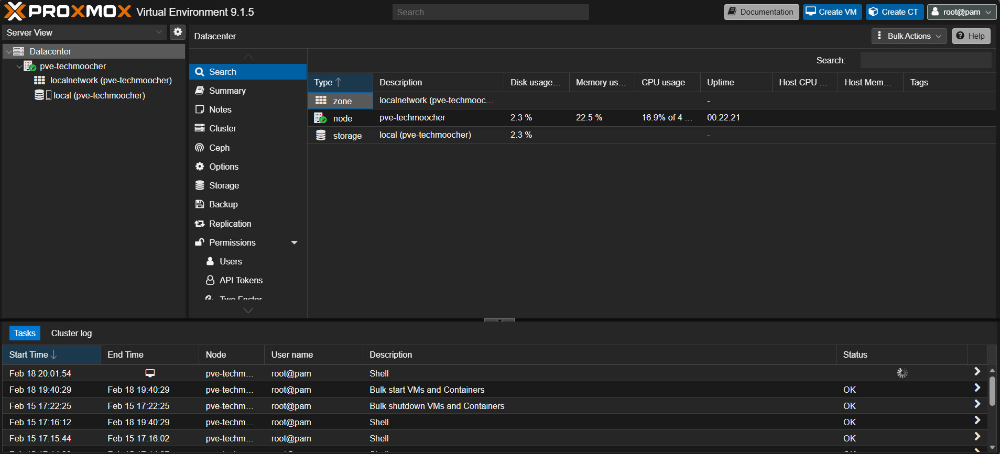
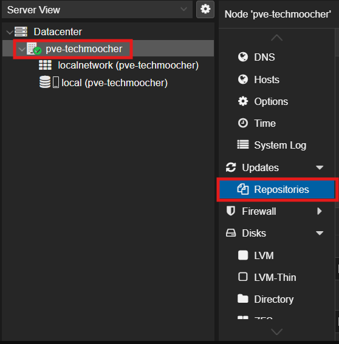
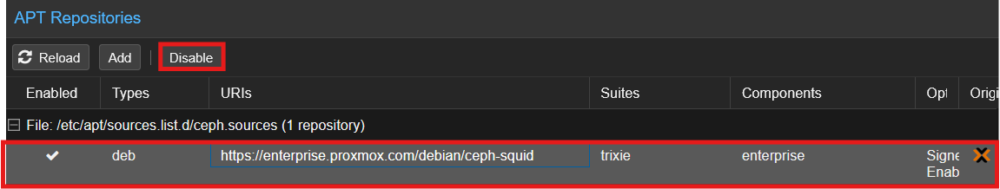

# Proxmox Installation and Configuration Walkthrough

---

[Proxmox Virtual Environment](https://www.proxmox.com/en/proxmox-ve) (Proxmox VE) is an open-source server virtualization management platform that allows you to easily create and manage virtual machines and containers. It is based on Debian Linux and uses KVM (Kernel-based Virtual Machine) for virtualization. Proxmox VE provides a web-based UI for managing your virtual environment, making it easy to create, configure, and monitor your virtual machines and containers. It also supports features like high availability, live migration, and storage management, making it a powerful tool for both homelabs and enterprise environments.

---

## Table of Contents

1. **[Installing Proxmox](#1-installing-proxmox)**
2. **[Updating Repos](#2-updating-repos)**
3. **[Deleting local-lvm *(optional)*](#3-deleting-local-lvm-optional)**
4. **[Enabling IOMMU *(optional)*](#4-enabling-iommu-optional)**
5. **[Keeping your server awake *(optional)*](#5-keeping-your-server-awake-optional)**
6. **[Setting screen timeout *(optional)*](#6-setting-screen-timeout-optional)**
7. **[Setting up firewall *(optional)*](#7-setting-up-firewall-optional)**
8. **[Adding your first storage *(optional)*](#8-adding-your-first-storage-optional)**
9. **[Creating your first container *(optional)*](#9-creating-your-first-container-optional)**

---

## 1. Installing Proxmox

Before we start, make sure you have a bootable USB drive with Proxmox on it. You can follow the [official Proxmox installation guide](https://proxmox.com/en/products/proxmox-virtual-environment/get-started) to create one. Once you have your bootable USB drive ready, insert it into your machine and boot from it. Follow the on-screen instructions to install Proxmox on your machine.

After the installation is complete, you can access the Proxmox web interface by navigating to `https://<your-node-ip>:8006` in your web browser. Now, you will be prompted to log in. Use the username `root` and the password you set during the installation process to log in. Once you are logged in, you will see the Proxmox dashboard where you can manage your virtual machines, containers, storage, and more.



## 2. Updating Repos

By default, Proxmox uses the enterprise apt repository which requires a subscription. Since we're using Proxmox for personal usage, we will change it to the no-subscription repository to get access to updates without needing a subscription.

To get started, in your Proxmox web interface, navigate to **Your node** > **Updates** > **Repositories**. You will see a warning that says `"The enterprise repository is enabled, but there is no active subscription!"`



In the **APT Repositories** section, navigate to the options that have **Components** labeled `enterprise` (those that have URIs starting with `https://enterprise.proxmox.com/`), and click on the **Disable** button to disable it. You will see the pop-up warning, click **OK** to skip it.



After that, click on the **Add** button to add a new repository. In the pop-up window, in the **Repository** line, click on the toggle-list and choose **No-Subscription**. Then, click **Add** to add the no-subscription repository. The URI should now be `https://download.proxmox.com/debian/pve`, and the components should be `pve-no-subscription`.

To have the changes take effect, enter the following command to update the package lists from the new repository.

```bash
apt update && apt upgrade -y
```

## 3. Deleting local-lvm *(optional)*

> **WARNING:**
> This assumes a fresh installation without advanced storage settings during the installation, such as ZFS. These steps are recommended if you have a small boot drive and you need to reclaim space.
>
> Skip this step at your demand.

You may have noticed that there is a storage labeled `local-lvm` in your Proxmox dashboard. This storage is created by Proxmox by default and uses LVM to manage the storage. In my case, I don't want to keep it, and I want to have my things (ISO images, containers, backups) in `local` (a.k.a the standard directory-based storage).

To remove the `local-lvm`, first, navigate to **Datacenter** > **Storage**. Choose the `local-lvm` option, click **Remove**, and click **Yes** to confirm. This will remove the `local-lvm` storage from your Proxmox. However, it will not delete the LVM itself, so we need to do that manually. To do that, navigate to **Node** > **Shell** and enter the following commands to remove the LVM and resize the root partition to use the full disk space.

```bash
lvremove /dev/pve/data                # remove the LVM
lvresize -l +100%FREE /dev/pve/root   # resize the root partition to use the full disk space
resize2fs /dev/mapper/pve-root        # resize the filesystem to use the full partition
```

To check if the changes are successful, you can use the following command to check the disk space.

```bash
df -h
lvdisplay
```

You should see that the `local-lvm` storage is removed and the root partition is resized to use the full disk space. If you don't see the changes, try rebooting your Proxmox server, and check again (repeat the above steps if necessary).

## 4. Enabling IOMMU *(optional)*

> Skip this step at your demand. Highly recommended if you plan to use hardware passthrough in the future.

An Input-Output Memory Management Unit (IOMMU) is a hardware component that allows the system to manage memory for I/O devices, such as graphics cards, network cards, and storage controllers. It provides a way for the system to map device memory to physical memory, which can improve performance and security. Enabling IOMMU can be beneficial for virtualization and hardware passthrough, as it allows virtual machines to directly access hardware resources without going through the hypervisor. You can learn more about IOMMU at its [Wikipedia page](https://en.wikipedia.org/wiki/Input%E2%80%93output_memory_management_unit).

To enable IOMMU, we will need to edit the GRUB configuration file.

```bash
nano /etc/default/grub
```

Scroll down until you find the line that says `GRUB_CMDLINE_LINUX_DEFAULT="quiet"`. This line is responsible for passing kernel parameters to the Linux kernel at boot time when the system is in normal mode. To enable IOMMU, change it to

```bash
GRUB_CMDLINE_LINUX_DEFAULT="quiet intel_iommu=on iommu=pt"
```

***Note:*** *If you are using AMD CPU, you should use `amd_iommu=on` instead.*

After that, save the file and exit. For the changes to take effect, update GRUB and reboot.

```bash
update-grub
reboot
```

When your system is back up, you can check if IOMMU is enabled with the following command.

```bash
dmesg | grep -e IOMMU
dmesg | grep 'remapping'
```

If you don't see any errors, it's a good sign that your system is working properly. If you happen to get any errors, reference to the [wiki](https://pve.proxmox.com/wiki/PCI_Passthrough) for more information.

You should see something like this, which indicates that IOMMU is enabled and working properly.

```bash
DMAR: IOMMU enabled

DMAR-IR: Enabled IRQ remapping in xapic mode    # x2apic mode in some systems
```

## 5. Keeping your server awake *(optional)*

> Skip this step at your demand. Highly recommended for servers running on laptops.

For me, due to availabibility purposes, I want to have my server awake even the lid is accidentially closed. To achieve that, we will need to edit the `logind.conf` file.

```bash
nano /etc/systemd/logind.conf   # you can use any text editor you like, but I will use nano for this example
```

Scroll down until you find the section that says `#HandleLidSwitch=...`, `#HandleLidSwitchExternalPower=...`, and `#HandleLidSwitchDocked=...`. These options are responsible for what happens when you close the lid of your laptop. To keep your server awake when the lid is closed, remove the `#` to uncomment and change them to

```bash
HandleLidSwitch=ignore
HandleLidSwitchExternalPower=ignore
HandleLidSwitchDocked=ignore
```

Make sure to save the file before exiting. For the changes to take effect, we need to restart the `systemd-logind.service` with the following command.

```bash
systemctl restart systemd-logind.service
```

## 6. Setting screen timeout *(optional)*

> Skip this step at your demand. Highly recommended for servers running on laptops.

To protect your screen from getting burnt due to constant workload, you may want to set a screen timeout to turn off the display after a certain period of inactivity. To do that, we will need to edit the GRUB configuration file.

First, open the GRUB configuration file with the following command.

```bash
nano /etc/default/grub
```

Scroll down until you find the line that says `GRUB_CMDLINE_LINUX=""`. This line is responsible for passing kernel parameters to the Linux kernel at boot time. To set the screen timeout, change it to

```bash
GRUB_CMDLINE_LINUX="consoleblank=<some value>"
```

***Note:*** *Set `<some-value>` (in seconds) to your desired timeout value (e.g: 300, which is 5 minutes).*

After that, save the file and exit. For the changes to take effect, update GRUB with the following command.

```bash
update-grub
```

## 7. Setting up firewall *(optional)*

> Skip this step at your demand. Highly recommended for security purposes.

Proxmox has a built-in firewall that you can use to secure your server. In this guide, we will use the **Shell** to set up the firewall, but you can also use the Proxmox web UI if you prefer a graphical user interface.

### Cluster-wide Setup

The cluster-wide firewall configuration is located at `/etc/pve/firewall/cluster.fw`.

```bash
nano /etc/pve/firewall/cluster.fw
```

The cluster-wide firewall is disabled by default. You can enable it by setting the `enable` option to `1`. You can also add your own rules to the file to allow or block specific traffic. In this example, we will allow ping and SSH traffic from the LAN, and block everything else.

```bash
[OPTIONS]
enable: 1

policy_in: DROP
policy_out: ACCEPT

log_ratelimit: enable=1,burst=10,rate=5/second

[RULES]
IN ACCEPT -source 192.168.50.0/24 -p icmp -log nolog -icmp-type any     # Allow ping from LAN
IN ACCEPT -source 192.168.50.0/24 -p tcp -dport 22 -log warning         # Allow SSH from LAN
IN ACCEPT -source 192.168.50.0/24 -p tcp -dport 8006 -log warning       # Allow Proxmox Web UI from LAN
```

### Host-specific Setup

The host-specific firewall configuration is located at `/etc/pve/nodes/<nodename>/host.fw`.

***Note:*** *You can find your node name using the `hostname` command in the shell.*

```bash
nano /etc/pve/nodes/<nodename>/host.fw
```

The host-specific firewall is enabled by default. You can add your own rules to the file to allow or block specific traffic. In this example, we will allow ping and SSH traffic from the LAN, and block everything else.

```bash
[OPTIONS]
enable: 1

log_level_in: warning
log_level_out: nolog
log_level_forward: nolog

nosmurfs: 1
smurf_log_level: warning

tcpflags: 1
tcp_flags_log_level: warning

ndp: 1
```

After finishing the configuration, save the file and exit. For the changes to take effect, you need to restart the firewall with the following command.

```bash
systemctl restart pve-firewall.service
```

To check if the firewall is working properly, you can use the following command to check the status of the firewall.

```bash
systemctl status pve-firewall.service
pve-firewall status
```

You should see that the firewall is active and running without any errors. You can also check the logs to see if any traffic is being blocked or allowed according to your rules.

## 8. Adding your first storage *(optional)*

> Skip this step at your demand. Highly recommended if you want to have a separate storages for different purposes (e.g: one for ISO images, one for containers, etc.).

Proxmox supports various types of storage, such as local storage, network storage, and more. In this guide, we will add a new storage for our Nextcloud data. You can follow the same steps to add other storages for different purposes. This will include [preparing](#preparing-the-disk), [partitioning](#partitioning-the-disk), and [mounting](#mounting-the-disk) the disk, and then [adding the storage to Proxmox](#adding-storage-to-proxmox).

### Preparing the disk

First, we need to prepare the disk. In this example, we will clear the disk, partition it, and mount it to a directory. You can adjust the steps according to your needs and preferences.

> **Note:** For the simplicity of this guide, we will use `dev/sdX` as the target disk. Make sure to replace `X` with the actual letter of your target disk (e.g., `dev/sdb`, `dev/sdc`, etc.). Also, we will use `dev/sdXn` to refer to the partition we will create on the target disk. Replace `n` with your actual partition number (e.g., `dev/sdb1`, `dev/sdb2`, etc.).
>
> You can identify your target disk with the `lsblk` command.
>
> **WARNING:** Some of the following commands are destructive and irreversible. Make sure to double-check the target disk before executing the commands to avoid unwanted data loss.

To wipe a disk, enter the following command.

```bash
wipefs /dev/sdX
```

#### OR

```bash
sudo dd if=/dev/zero of=/dev/sdX bs=1M status=progress  # Completely overwrite the disk with zeros (may take a "long" while)
```

### Partitioning the disk

Next, we need to partition the disk. We will use `fdisk` for this task, but you can use other tools depending on your preference.

```bash
fdisk /dev/sdX
```

On the `fdisk` interface, follow the instructions on the screen to create a new partition.

- Enter `g` for creating a new GPT table.
- Enter `n` to create a new partition.
- Type in your desired partition number.
- Enter your desired start block (in most case you just press `Enter` for the default start block).
- Enter `+<desired-value>G` to set the partition to the desired size.
- Refer to the instructions on the screen for further personalization (use `m` for help).
- Once you're done, enter `w` to exit and write changes.

Now, you should have a new partition on your disk. You can check it with the `lsblk` command. To format the partition with the `ext4` filesystem, enter the following command.

```bash
mkfs.ext4 /dev/sdXn   # Replace {X} with your target disk letter, and {n} with your partition number
```

> You can also use other filesystems such as `xfs`, `btrfs`, etc. depending on your needs and preferences.

### Mounting the disk

Next, we need to mount the partition to a directory. In this example, we will mount it to `/srv/nextcloud-data`, but you can choose any directory you like.

```bash
mkdir -p /srv/nextcloud-data
mount /dev/sdXn /srv/nextcloud-data
echo "/dev/sdXn /srv/nextcloud-data ext4 defaults 0 2" | tee -a /etc/fstab   # For automatic mounting on boot
mount -a    # Test if there's any problem with mounting
```

Besides, you can also mount the partition with its UUID for better reliability. To do that, first, get the UUID of the partition with the following command.

```bash
blkid /dev/sdXn
```

Then, use the UUID to mount the partition.

```bash
echo "UUID=<your-uuid> /srv/nextcloud-data ext4 defaults 0 2" | tee -a /etc/fstab   # Replace <your-uuid> with your actual UUID
mount -a    # Test if there's any problem with mounting
```

### Adding storage to Proxmox

To add the new storage to Proxmox, navigate to **Datacenter** > **Storage**. Click on the **Add** button, choose the storage type (e.g., `Directory`), and fill in the details:

- **ID**: Enter a unique ID for the storage (e.g., `nextcloud`).
- **Directory**: Enter the path to the directory where the partition is mounted (e.g., `/srv/nextcloud-data`).
- Configure other options as needed (e.g., content types, nodes, etc.).

After filling in the details, click **Add** to add the storage to Proxmox. You should now see the new storage in the list of storages. You can use this storage for your virtual machines, containers, backups, and more.

## 9. Creating your first container *(optional)*

> Skip this step at your demand. Highly recommended if you want to get familiar with Proxmox and start self-hosting.

A Linux Container (LXC) is a lightweight virtualization technology that allows you to run multiple isolated Linux systems (containers) on a single host. It is similar to Docker but provides a more complete Linux environment. LXC containers share the same kernel as the host system, which makes them more efficient and faster than traditional virtual machines. You can learn more about LXC at its [Wikipedia page](https://en.wikipedia.org/wiki/LXC).

To create your first container, navigate to **Node** > **Create CT**. This will open a wizard that will guide you through the process of creating a new container.

### a. General

- Set **CT ID** *(e.g. 100)*.
- Set **Hostname** *(e.g. nextcloud)*.
- Create a **Password** or Upload an **SSH key** for authentication.
- Set `unprivileged` to `true` *(optional, but highly recommended for security purposes)*.

### b. Template

- Choose a Linux distro **Template** *(e.g. Debian 12)*.

### c. Disks

- Choose the **Storage** location *(e.g. `local`)*.
- Set **Disk size** *(usually 8 GiB is enough; adjust at your demand)*.

### d. CPU

- Set the number of **CPU Cores** *(usually 1 to 2 cores are engouh; adjust at your demand)*.

### e. Memory

- Set **Memory** size *(1024 MiB is (more than) enough for most cases; adjust at your demand)*.
- Set **Swap** size as needed *(512 MiB is recommended; adjust at your demand)*.

### f. Network

- Configure the network settings:
  - Set **Bridge** to `vmbr0` (or your default bridge).
  - Set **Firewall** to `enabled` if you want to use Proxmox's firewall features.
  - Set **VLAN Tag** if needed (optional).
- Set **a static IP address** *(e.g. `192.168.1.100/24`)* or leave it to **DHCP** (managed by your router) *(IPv4 is recommended for simplicity; you may choose IPv6 as needed)*.

### g. DNS

- Configure DNS servers at your demand. *(recommended to leave it as `use host settings` unless you know what you're doing)*.

### h. Confirm

- Review the settings and click **Finish** to create the container.

A container will be created. Enable `start-on-boot` so that it starts automatically when the Proxmox server boots up.

---

Now, you have successfully installed Proxmox and done some basic configurations. You can now start creating virtual machines, containers, and more to explore the capabilities of Proxmox. You can check out the [How To Use This Repo](../README.md#how-to-use-this-repo) in the [README](../README.md) for more.

I hope this guide is helpful for you in your homelab journey. If you have any questions or suggestions, feel free to reach out to me through email or opening an issue in this repository.

**HAPPY SELF-HOSTING!!!**
