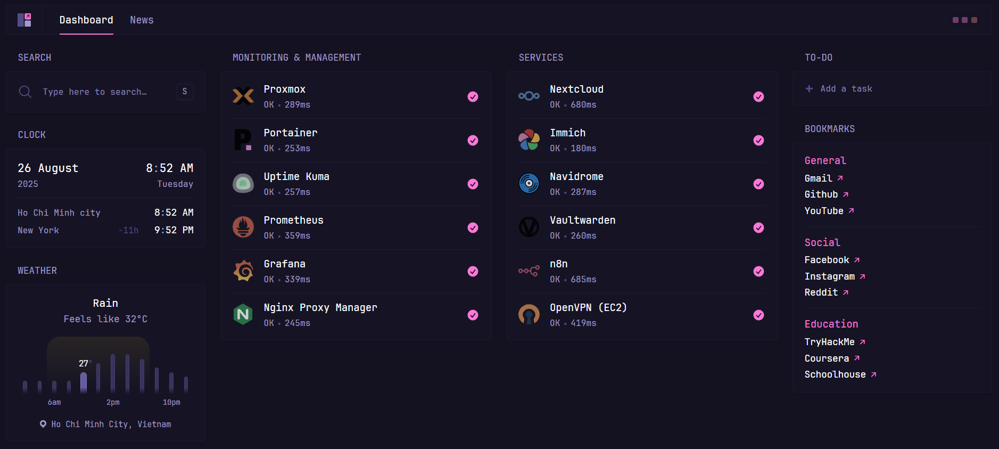

# My Glance Dashboard

This is my setup for Glance Dashboard in my Proxmox server.

## Preview


## Installation

You can refer to <a href="https://github.com/glanceapp/glance" target="_blank">Glance official repo</a> for the official installation guide.

Alternatively, you can use my setup. If you choose this option, follow the steps below

1. **Make a directory for your file**
```bash
mkdir glance && cd glance
```

2. **Initialize Git and add the remote repo**
```bash
git init
git remote add -f origin https://github.com/techmoocher/homelab/
```

3. **Enable and configure sparse checkout**
```bash
git config core.sparseCheckout true
echo "services/glance/" >> .git/info/sparse-checkout
```

4. **Pull the files**
```bash
git pull origin main
```

Now, edit the following files as desired:
* `docker-compose.yml` to configure the port, volumes and other containery things
* `config/home.yml` to configure the widgets or layout of the home page
* `config/glance.yml` if you want to change the theme or add more pages

Other files you may want to edit:
* `.env` to configure environment variables that will be available inside configuration files
* `assets/user.css` to add custom CSS

When you're ready, run:
```bash
docker compose up -d
```

If you encounter any issues, you can check the logs:
```bash
docker compose logs
```
