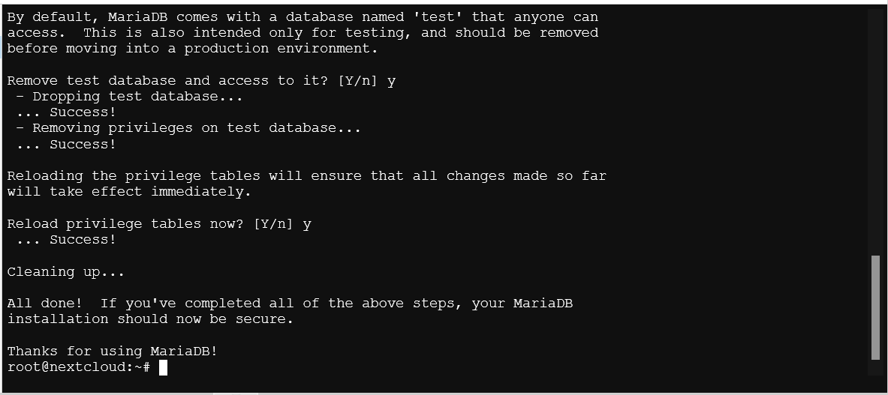

# Nextcloud in LXC

---

[Nextcloud](https://nextcloud.com) is a popular open-source self-hosted cloud storage solution. It allows you to store and access your files, calendars, contacts, and more from any device.

**Why Nextcloud?**

- **Privacy**: Nextcloud gives you full control over your data. You can host it on your own server, ensuring that your files are not stored on third-party servers.
- **Customization**: Nextcloud offers a wide range of apps and plugins that allow you to customize your cloud storage experience. You can add features such as file sharing, calendar integration, and more.
- **Collaboration**: Nextcloud allows you to collaborate with others by sharing files and folders. You can set permissions for each user, ensuring that your data is secure.
- **Accessibility**: Nextcloud can be accessed from any device with an internet connection. You can use the web interface, desktop clients, or mobile apps to access your files and data.

---

## 1. LXC Setup

Before we start installing Nextcloud, we need to set up an LXC container to host our Nextcloud instance. Follow the instructions in the [LXC Setup](../../proxmox/README.md#9-creating-your-first-container-optional) guide to create a new container for Nextcloud. I recommend choosing **Ubuntu 24.04 LTS** as the operating system for your container, and allocating allocating at least **2 CPU cores**, **2GB of RAM *(1-2GB of SWAP at your demand)***, and **16GB of storage** for the container. We would recommend adding a mount point for your Nextcloud data if you have additional storage available. This will allow you to store your Nextcloud data on a separate partition or disk, which can improve performance and make it easier to manage your data.

## 2. Installing Dependencies

Nextcloud requires a web server, a database server, and PHP to run. In this guide, we will be using **Apache2** as our web server, **MariaDB** as our database server, and PHP as our scripting language. To learn more about the installation process, check out the [Nextcloud documentation](https://docs.nextcloud.com/server/stable/admin_manual/installation/index.html).

Before we start installing the dependencies, make sure to update your package list and upgrade your system by running the following commands:

```bash
apt update && apt upgrade -y
```

### Apache2

[Apache2](https://httpd.apache.org/) is a popular open-source web server that is widely used to host websites and web applications. It is known for its stability, security, and flexibility, making it a great choice for hosting Nextcloud.

To install Apache2, run the following command:

```bash
apt install apache2 -y
```

Once the installation is complete, you can start Apache2 and enable it to run on boot with the following commands:

```bash
systemctl start apache2
systemctl enable apache2
```

To check if Apache2 is running properly, you can use the following command:

```bash
systemctl status apache2
```

If Apache2 is running properly, you should see an output indicating that the service is active and running. You can also open a web browser and navigate to your server's IP address to see the default Apache2 welcome page.


### MariaDB Server

[MariaDB](https://mariadb.org/) is a popular open-source relational database management system that is widely used to store data for web applications. It is a fork of MySQL and is known for its performance, reliability, and security.

To install MariaDB, run the following command:

```bash
apt install mariadb-server -y
```

Once the installation is complete, you can start the MariaDB security installation process by running the following command:

```bash
mariadb-secure-installation
```

#### OR

```bash
mysql_secure_installation
```

This will guide you through a series of prompts to secure your MariaDB installation. You will be asked to set a root password, remove anonymous users, disallow remote root login, and remove the test database. If this is your first time installing MariaDB and you have no idea what to do, follow the instructions in the video below:

[](./assets/mariadb-secure-installation.mkv)

Once you have completed the security installation process, you're good to go.

### PHP

[PHP](https://www.php.net/) is a popular server-side scripting language that is widely used to develop web applications. Nextcloud is operated using PHP, so we need to install it along with the necessary PHP modules to run Nextcloud smoothly.

We will be using **PHP 8.3**, as recommended by the Nextcloud documentation. To install it, use the following command

```bash
apt install php8.3 -y
```

<i>Check out <a href="https://docs.nextcloud.com/server/latest/admin_manual/installation/php_configuration.html" target="_blank">PHP Modules & Configuration</a> for more details</i>

<p>Enter the following commands to install necessary PHP modules</p>

```bash
apt install phpX.x-{curl,gd,zip,xml,mbstring,mysql,intl,imagick,imap}
```
