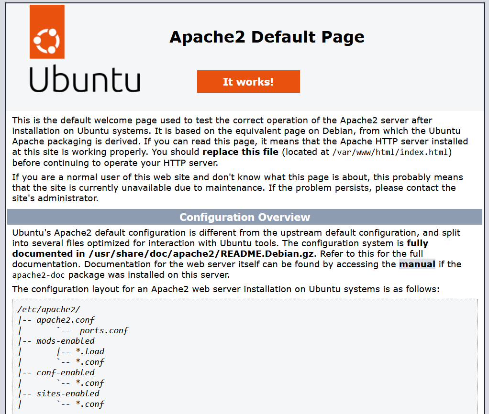
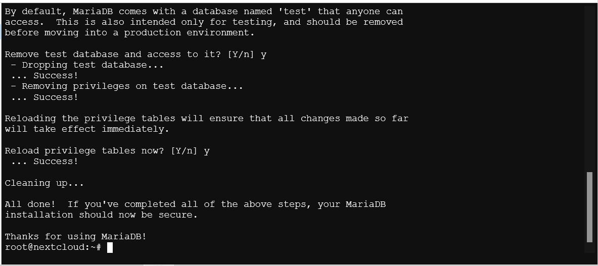
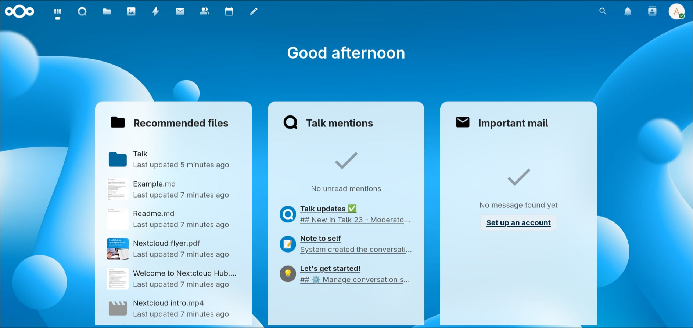

# Nextcloud on LXC

---

[Nextcloud](https://nextcloud.com) is a popular open-source self-hosted cloud storage solution. It allows you to store and access your files, calendars, contacts, and more from any device.

**Why Nextcloud?**

- **Privacy**: Nextcloud gives you full control over your data. You can host it on your own server, ensuring that your files are not stored on third-party servers.
- **Customization**: Nextcloud offers a wide range of apps and plugins that allow you to customize your cloud storage experience. You can add features such as file sharing, calendar integration, and more.
- **Collaboration**: Nextcloud allows you to collaborate with others by sharing files and folders. You can set permissions for each user, ensuring that your data is secure.
- **Accessibility**: Nextcloud can be accessed from any device with an internet connection. You can use the web interface, desktop clients, or mobile apps to access your files and data.

---

## Table of Contents

1. [LXC Setup](#1-lxc-setup)
2. [Installing Dependencies](#2-installing-dependencies)
    - 2.1. [Apache2](#21-apache2)
    - 2.2. [MariaDB Server](#22-mariadb-server)
        - 2.2.1. [MariaDB Installation](#221-mariadb-installation)
        - 2.2.2. [Database and User Setup](#222-database-and-user-setup)
        - 2.2.3. [Optimizing MariaDB *(optional)*](#223-optimizing-mariadb-optional)
    - 2.3. [PHP](#23-php)
        - 2.3.1. [PHP Installation](#231-php-installation)
        - 2.3.2. [Caching Configuration](#232-caching-configuration)
        - 2.3.3. [PHP Configuration](#233-php-configuration)
        - 2.3.4. [Tuning PHP-FPM Pool *(optional)*](#234-tuning-php-fpm-pool-optional)
3. [Installing Nextcloud](#3-installing-nextcloud)
4. [Finalizing Nextcloud Installation](#4-finalizing-nextcloud-installation)
5. [Post-Installation](#5-post-installation)

---

## 1. LXC Setup

Before we start installing Nextcloud, we need to set up an LXC container to host our Nextcloud instance. Follow the instructions in the [LXC Setup](../../proxmox/README.md#9-creating-your-first-container-optional) guide to create a new container for Nextcloud. The below specifications are recommended for a smooth Nextcloud experience, but you can adjust them based on your needs and the resources available on your host machine.

### Recommended Specs

- **CPU:** 2 vCPUs
- **RAM:** 2 GB *(4 if applicable)*
- **Storage:** 16 GB *(or more depending on your needs)*
- **Template:** Ubuntu 24.04 LTS
- **Type**: Unprivileged

***Note:*** *You can mount additional storage to the container if you want to separate the container's data and Nextcloud's data. Check out the [Mounting Storage](../../proxmox/README.md#10-mounting-storage-to-your-container-optional) guide for instructions on how to do this.*

***Note:*** *If you mount external Proxmox storage to an unprivileged container, remember to set host ownership to 100033:100033.*

## 2. Installing Dependencies

Nextcloud requires a web server, a database server, and a runtime environment. In this guide, we will be using **Apache2** as our web server, **MariaDB** as our database server, and **PHP** as our runtime environment. To learn more about the installation process, check out the [Nextcloud documentation](https://docs.nextcloud.com/server/stable/admin_manual/installation/index.html).

Before we start installing the dependencies, make sure to update your package list and upgrade your system by running the following commands:

```bash
apt update && apt upgrade -y
apt install -y curl wget unzip ffmpeg imagemagick
```

### 2.1. Apache2

[Apache2](https://httpd.apache.org/) is a popular open-source web server that is widely used to serve web applications. It is known for its stability, security, and flexibility. In this guide, we will be using **Apache 2.4**. You can install other versions if you prefer, but make sure to check the official documentation before doing so.

To install Apache2, run the following command:

```bash
apt install apache2 -y
```

Once the installation is complete, you can start Apache2 and enable it to run on boot with the following commands:

```bash
systemctl start apache2
systemctl enable apache2
```

To enable necessary Apache2 modules for Nextcloud, run the following command:

```bash
a2enmod rewrite headers env dir mime proxy_fcgi setenvif ssl
systemctl restart apache2
```

To check if Apache2 is running properly, you can use the following command:

```bash
systemctl status apache2
```

You can also check if Apache2 is serving content by navigating to `http://<your-container-ip>` in your web browser. You should see the default Apache2 welcome page.



### 2.2. MariaDB Server

#### 2.2.1. MariaDB Installation

[MariaDB](https://mariadb.org/) is a popular open-source relational database management system that is widely used to store data for web applications. It is a fork of MySQL and is known for its performance, reliability, and security. In this guide, we will be using **MariaDB 10.11**. You can install other versions of MariaDB if you prefer, but make sure to check the official documentation before doing so.

To install MariaDB, run the following command:

```bash
apt install mariadb-server -y
```

Once the installation is complete, you can start the MariaDB security installation process by running the following command:

```bash
mysql_secure_installation
```

or

```bash
mariadb-secure-installation
```

This will guide you through a series of prompts to secure your MariaDB installation. You will be asked to set a root password, remove anonymous users, disallow remote root login, and remove the test database. If this is your first time installing MariaDB and you have no idea what to do, follow the instructions in the video below:

[](./assets/mariadb-secure-installation.mp4)

#### 2.2.2. Database and User Setup

Nextcloud requires a database and a user to connect to that database. You can create a new database and user for Nextcloud by running the following commands:

```bash
mysql -u root -p
```

or

```bash
mariadb -u root -p
```

This will open the MariaDB shell. Run the following commands to create a new database and user for Nextcloud:

```sql
CREATE DATABASE nextcloud CHARACTER SET utf8mb4 COLLATE utf8mb4_bin;
CREATE USER 'nextclouduser'@'localhost' IDENTIFIED BY 'strongpassword';
GRANT ALL PRIVILEGES ON nextcloud.* TO 'nextclouduser'@'localhost';
FLUSH PRIVILEGES;
EXIT;
```

***Note:*** Make sure to replace `nextclouduser` with a username of your choice and `strongpassword` with a strong password of your choice. You will need this password later when you configure Nextcloud.

To check if the database and user were created successfully, you can run the following command:

```bash
mysql -u root -p -e "SHOW DATABASES; SHOW GRANTS FOR 'nextclouduser'@'localhost';"
```

You should see the `nextcloud` listed in the databases and the appropriate privileges for the `nextclouduser`.

#### 2.2.3. Optimizing MariaDB *(optional)*

To optimize MariaDB, open the file `etc/mysql/mariadb.conf.d/50-server.cnf` with your preferred text editor and make the following changes:

```cnf
[mysqld]
innodb_file_per_table=1
innodb_default_row_format=dynamic
innodb_buffer_pool_size=512M

character-set-server=utf8mb4
collation-server=utf8mb4_bin
```

Then, restart MariaDB with the following command:

```bash
systemctl enable mariadb
systemctl restart mariadb
```

### 2.3. PHP

#### 2.3.1. PHP Installation

[PHP](https://www.php.net/) is a popular server-side scripting language that is widely used to develop web applications. Nextcloud is operated using PHP, so we need to install it along with the necessary PHP modules to run Nextcloud smoothly.

For the simplicity of this guide, we will use **PHP 8.3**, which is the version recommended by Nextcloud at the time of writing. You can install other versions of PHP if you prefer. Check out the [System Requirements](https://docs.nextcloud.com/server/latest/admin_manual/installation/system_requirements.html) and [PHP Modules & Configuration](https://docs.nextcloud.com/server/latest/admin_manual/installation/php_configuration.html) documentation for more details.

To install PHP and necessary modules, run the following command:

```bash
apt install -y \
 php8.3 php8.3-fpm php8.3-cli php-json php-intl php-imagick \
 php8.3-{common,curl,gd,mbstring,xml,zip,mysql,imap,opcache,ldap,gmp,bz2}
```

#### 2.3.2. Caching Configuration

Nextcloud can use caching to improve performance. We will be using **APCu** for local caching and **Redis** for distributed caching. To install these caching modules, run the following command:

```bash
apt install -y redis-server php-{apcu,redis}
```

Once the installation is complete, you can start the Redis server and enable it to run on boot with the following commands:

```bash
systemctl start redis-server
systemctl enable redis-server
```

You can also test the Redis server by running the following command:

```bash
redis-cli ping
```

which should return

```bash
PONG
```

To configure Redis, we need to make some changes to the `/etc/redis/redis.conf` file. Open the file with your preferred text editor and make the following changes:

```conf
unixsocket /run/redis/redis-server.sock
unixsocketperm 770
```

Finally, add the `www-data` user to the `redis` group to allow PHP-FPM to access the Redis socket:

```bash
usermod -aG redis www-data
systemctl enable redis-server
systemctl restart redis-server
```

#### 2.3.3. PHP Configuration

By default, the configuration files for PHP are located in the `/etc/php/X.x/` directory *(`X.x` is the PHP version which, in this case, is `8.3`)*. The configuration for the web server (in this case, Apache2 + php-fpm) lives in `/etc/php/8.3/fpm/php.ini`.

Open the `php.ini` file with your preferred text editor and make the following changes:

```ini
memory_limit = 1024M
upload_max_filesize = 2048M
post_max_size = 2048M
max_execution_time = 360

date.timezone = America/New_York    # Replace with your actual timezone

opcache.enable=1
opcache.enable_cli=1
opcache.memory_consumption=256
opcache.interned_strings_buffer=16
opcache.max_accelerated_files=20000
opcache.revalidate_freq=60
opcache.save_comments=1
```

#### 2.3.4. Tuning PHP-FPM Pool *(optional)*

To optimize PHP-FPM for Nextcloud, we can make some changes to the pool configuration file, which is `/etc/php/8.3/fpm/pool.d/www.conf`. Open the file with your preferred text editor and make the following changes:

```conf
pm = dynamic
pm.max_children = 18
pm.start_servers = 4
pm.min_spare_servers = 3
pm.max_spare_servers = 6
pm.max_requests = 500
```

For the changes to take effect, restart the PHP-FPM service:

```bash
a2enconf php8.3-fpm
systemctl restart php8.3-fpm apache2
```

## 3. Installing Nextcloud

### 3.1. Nextcloud Installation

Now that we have all the dependencies installed and configured, we can proceed to install Nextcloud. The latest version of Nextcloud can be downloaded from the [Nextcloud website](https://nextcloud.com/install/). Use the following command to download the latest version of Nextcloud:

```bash
mkdir -p /var/cache/nextcloud && cd /var/cache/nextcloud
wget https://download.nextcloud.com/server/releases/latest.zip
unzip latest.zip
mv nextcloud /var/www/
rm -rf /var/cache/nextcloud
```

Next, we need to set the correct permissions for the Nextcloud files. Run the following commands to set the ownership and permissions:

```bash
cd /var/www
chown -R www-data:www-data /var/www/nextcloud
find /var/www/nextcloud -type d -exec chmod 750 {} \;
find /var/www/nextcloud -type f -exec chmod 640 {} \;
```

***Note:*** *If you have mounted additional storage for Nextcloud, you can set the ownership and permissions for that storage as well. For example, if you have mounted a storage at `/srv/nextcloud-data` on your host machine, you can run the following commands:*

```bash
# On your Proxmox host
chown -R 100033:100033 /srv/nextcloud-data
chmod -R 750 /srv/nextcloud-data

# Inside your LXC container
chown -R www-data:www-data /path/to/mounted/storage
chmod -R 750 /path/to/mounted/storage
```

### 3.2. Apache2 Configuration

Nextcloud is now installed, but we still need an Apache2 virtual host configuration for Nextcloud. Create a new file called `/etc/apache2/sites-available/nextcloud.conf` with the following content:

```conf
<VirtualHost *:80>
    ServerName nextcloud.example.com    # Replace example.com with your actual domain
    DocumentRoot /var/www/nextcloud

    <Directory /var/www/nextcloud/>
        Require all granted
        AllowOverride All
        Options FollowSymLinks MultiViews
        <IfModule mod_dav.c>
            Dav off
        </IfModule>
    </Directory>

    ErrorLog ${APACHE_LOG_DIR}/nextcloud_error.log
    CustomLog ${APACHE_LOG_DIR}/nextcloud_access.log combined
</VirtualHost>
```

and then enable the virtual host and restart Apache2:

```bash
a2ensite nextcloud.conf
a2dissite 000-default.conf
systemctl reload apache2
```

## 4. Finalizing Nextcloud Installation

Now that we have Nextcloud installed and configured, we can finalize the installation by navigating to `http://<your-container-ip>` in your web browser. You should see the Nextcloud setup page where you can create an admin account and enter the database details that we created earlier.

There are some fields that you need to fill out:

- **Admin Account**: Create an admin account by entering a username and password of your choice.
- **Data Folder**: By default, Nextcloud will store its data in the `data` folder inside the Nextcloud directory. You can change this to a different location if you want, but make sure to set the correct permissions for that folder.
- **Database Configuration**: Select "MySQL/MariaDB" as the database type, and enter the database name, username, password that we created earlier. The database host should be `localhost`.

Once you have filled out all the fields, click on the **Install** button to complete the installation. Nextcloud will now set up the database and configure itself based on the information you provided. Nextcloud will also ask if you to install recommended apps, which you can choose to do or skip for now. After the installation is complete, you will be redirected to the Nextcloud dashboard where you can start using Nextcloud.



## 5. Post-Installation

### 5.1. Enabling Caching

Open the config file `/var/www/nextcloud/config/config.php` with your preferred text editor and add the following lines before the closing `);` to enable caching with APCu and Redis:

```php
  'memcache.local' => '\OC\Memcache\APCu',
  'memcache.distributed' => '\OC\Memcache\Redis',
  'memcache.locking' => '\OC\Memcache\Redis',
  'redis' => 
  array (
    'host' => '127.0.0.1',
    'port' => 6379,
    'timeout' => 0.0,
  ),
```

### 5.2 Enabling Background Cron

By default, Nextcloud uses AJAX to run background tasks, but it is recommended to use the system cron for better performance and reliability. To enable the system cron, run the following command:

```bash
crontab -u www-data -e
```

and add the following line to the bottom:

```cron
*/5 * * * * php -f /var/www/nextcloud/cron.php
```


---

Congratulations! You have successfully installed Nextcloud on an LXC container. You can now start uploading files, creating folders, and using all the features Nextcloud offers. Make sure to keep your Nextcloud instance updated and secured by following the best practices outlined in the [Nextcloud documentation](https://docs.nextcloud.com/server/latest/admin_manual/maintenance/index.html).

**HAPPY SELF-HOSTING!!!**
